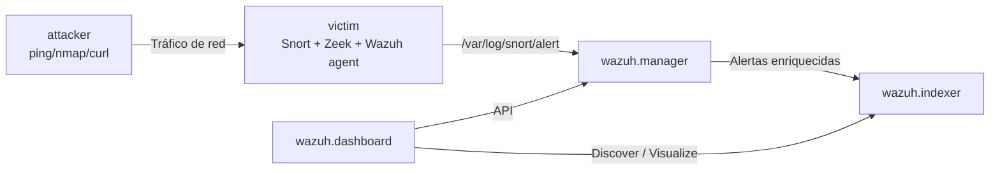

# Laboratorio SIEM con Wazuh + Snort (Docker)

Laboratorio SIEM totalmente contenedorizado que valida el flujo completo
**ataque → detección de red (Snort) → recolección (Wazuh agent) → correlación (Wazuh manager) → visualización (Wazuh dashboard)** en una sola máquina.

La parte central del laboratorio es un **kill-chain externo en 5 etapas** contra el nodo `victim`. Cada etapa dispara una regla Snort propia (SIDs `1010101`–`1010105`) y Wazuh correlaciona las etapas del mismo origen para emitir una alerta **HIGH** (`100390`) o **CRITICAL** (`100391`) en el Dashboard.

---

## 1. Arquitectura

Tres nodos lógicos, una única red Docker `siem-lab-net`:

| Contenedor | Rol | Componentes |
|------------|-----|-------------|
| `wazuh.manager` | servidor SIEM | Wazuh manager 4.14.3 |
| `wazuh.indexer` | almacenamiento | OpenSearch 4.14.3 |
| `wazuh.dashboard` | UI | Wazuh dashboard 4.14.3 |
| `victim` | objetivo + sensor | Wazuh agent, Snort, Zeek, HTTP server en `8080` |
| `attacker` | generador de tráfico | `ping`, `nmap`, `curl`, `hping3` |



---

## 2. Requisitos

- Docker Desktop (o Docker + Docker Compose v2) con al menos 4 GB de RAM asignados.
- Puertos libres en el host: `5602`, `9201`, `55000`, `1514`, `1515`, `514/udp`, `8081`.
- En Apple Silicon (M1/M2/M3) los contenedores `victim` y `attacker` usan `platform: linux/amd64` por compatibilidad con Zeek (configurado ya en `docker-compose.yml`).

Puertos expuestos en el host:

| Servicio | URL |
|----------|-----|
| Dashboard | `https://localhost:5602` (user `admin` / pass `SecretPassword`) |
| Indexer | `https://localhost:9201` |
| API Manager | `https://localhost:55000` |
| HTTP del victim | `http://localhost:8081` |

---

## 3. Arranque (cómo correr el lab)

### 3.1 Generar certificados del indexer (solo la primera vez)

```bash
docker compose -f generate-indexer-certs.yml run --rm generator
```

### 3.2 Construir y levantar toda la pila

```bash
docker compose up -d --build
```

Este paso es obligatorio después de tocar cualquier archivo dentro de `docker/victim/` (Dockerfile, entrypoint, reglas Snort), porque esos ficheros se copian al construir la imagen.

### 3.3 Verificar que todo está en marcha

```bash
docker compose ps
```

Deberías ver cinco contenedores en estado `running`:

```
NAME              STATE     STATUS
attacker          running   Up
victim            running   Up
wazuh-dashboard   running   Up
wazuh-indexer     running   Up
wazuh-manager     running   Up
```

Confirma que el agente del victim está activo en el manager:

```bash
docker compose exec wazuh.manager /var/ossec/bin/agent_control -l
```

Resultado esperado: `ID: 003, Name: victim-agent, IP: any, Active`.

> Si tocas solo ficheros montados por volumen (`config/wazuh_manager/rules`, `config/wazuh_manager/decoders`, …) basta con:
>
> ```bash
> docker compose restart wazuh.manager
> ```
>
> Si tocas volúmenes o `docker-compose.yml`, usa `docker compose up -d wazuh.manager` (un simple `restart` no reaplica montajes).

---

## 4. Cómo atacar: el escenario Snort

### 4.1 Narrativa del kill-chain

El atacante externo ejecuta 5 etapas encadenadas contra el servicio web de `victim`. Cada etapa está pensada para disparar exactamente **una** regla Snort del laboratorio.

| Etapa | Fase MITRE | Tráfico del atacante | Snort SID | Tag Wazuh (tras decoder) |
|-------|------------|----------------------|-----------|--------------------------|
| 1 | Reconnaissance (TA0043) | `ping -c 3 victim` | `1010101` | `100360` · level 5 |
| 2 | Discovery / Active Scanning (T1046) | `nmap -sS -p 22,80,445,3306,8080` | `1010102` | `100361` · level 6 |
| 3 | Initial Access — Web probe (T1190) | `curl /admin`, `/login`, `/.env`, … | `1010103` | `100362` · level 8 |
| 4 | Exploitation — SQLi / LFI | `curl "?q=' OR 1=1"`, `?path=../../etc/passwd` | `1010104` | `100363` · level 10 |
| 5 | Exfiltration / C2 | `POST` con UA `python-requests` | `1010105` | `100364` · level 11 |

Correlación final en Wazuh (misma IP origen, ventana 600 s):

| Regla Wazuh | Condición | Nivel | Severidad Dashboard |
|-------------|-----------|-------|---------------------|
| `100390` | ≥ 3 etapas distintas del mismo origen | 12 | **HIGH** |
| `100391` | 5 etapas del mismo origen (kill-chain completa) | 15 | **CRITICAL** |

Ubicación de los ficheros clave:

- Regla Snort: [`docker/victim/snort-lab-chain.rules`](docker/victim/snort-lab-chain.rules)
- Regla Wazuh: [`config/wazuh_manager/rules/snort_correlation_rules.xml`](config/wazuh_manager/rules/snort_correlation_rules.xml)
- Orquestador del ataque: [`scripts/run-snort-chain-scenario.sh`](scripts/run-snort-chain-scenario.sh)
- Entrypoint del victim (arranque de Snort, agent, Zeek, …): [`docker/victim/victim-entrypoint.sh`](docker/victim/victim-entrypoint.sh)

### 4.2 Lanzar el ataque (una sola orden)

```bash
./scripts/run-snort-chain-scenario.sh
```

El script ejecuta en el contenedor `attacker`, en orden:

```bash
ping -c 3 victim                                    # Stage 1
nmap -sS -p 22,80,445,3306,8080 victim              # Stage 2
curl http://victim:8080/{admin,login,.env,…}        # Stage 3
curl "http://victim:8080/?q=' OR 1=1 --"            # Stage 4
curl "http://victim:8080/file?path=../../../etc/passwd"
curl -X POST -A "python-requests/2.28" …            # Stage 5
```

Uso con otro objetivo / puerto:

```bash
./scripts/run-snort-chain-scenario.sh victim 8080
```

### 4.3 Ataque básico de una sola línea (sin kill-chain)

```bash
docker compose exec attacker /usr/local/bin/attack-simulate.sh victim 8080
```

### 4.4 Cadena de ataque extendida (Snort + SSH threatfeed)

Incluye el kill-chain anterior **más** inyección de logs SSH para validar las reglas `100200`/`100201`:

```bash
./scripts/run-attack-chain.sh
./scripts/run-attack-chain.sh victim 8080 196.251.85.62   # con IP maliciosa concreta
```

---

## 5. Cómo ver los resultados

### 5.1 Logs crudos de Snort en el agente

```bash
docker compose exec victim tail -n 120 /var/log/snort/alert
```

Líneas esperadas después del escenario (extracto):

```
[**] [1:1010101:11] LAB Stage1 Reconnaissance: ICMP echo probe [**]
[**] [1:1010102:11] LAB Stage2 Service Discovery: SYN probe on well-known port [**]
[**] [1:1010103:11] LAB Stage3 Initial Access: HTTP request to sensitive path [**]
[**] [1:1010104:11] LAB Stage4 Exploit attempt: SQLi or path-traversal payload in HTTP URI [**]
[**] [1:1010105:11] LAB Stage5 Exfiltration/C2: HTTP POST with automation User-Agent [**]
```

### 5.2 Confirmar la correlación en el manager

```bash
docker compose exec wazuh.manager bash -lc \
  'tail -n 400 /var/ossec/logs/alerts/alerts.log \
   | grep -E "Rule: (10036[0-4]|10039[01])"'
```

Deben aparecer las cinco etiquetas (`100360`–`100364`) y, si ha llegado la 5ª etapa, la correlación `100391` (CRITICAL).

### 5.3 Dashboard web

1. Abrir `https://localhost:5602` (acepta el certificado autofirmado).
2. Login con `admin` / `SecretPassword`.
3. Módulo **Discover** → patrón de índice `wazuh-alerts-*`.
4. Ajustar el time-picker a *Last 15 minutes* (o al intervalo en que lanzaste el ataque).

Consultas listas para copiar (DQL):

**a) Eventos Snort crudos, una línea por paquete**

```text
agent.name:"victim-agent" AND location:"/var/log/snort/alert" AND data.id:("1:1010101:11" OR "1:1010102:11" OR "1:1010103:11" OR "1:1010104:11" OR "1:1010105:11")
```

**b) Una alerta por etapa (dedup 60 s, narrativa limpia)**

```text
agent.name:"victim-agent" AND rule.id:(100360 OR 100361 OR 100362 OR 100363 OR 100364)
```

**c) Correlación final HIGH / CRITICAL (la "portada" del ataque)**

```text
agent.name:"victim-agent" AND rule.id:(100390 OR 100391)
```

Los hits de `100391` muestran `Src IP: 172.20.0.X` (attacker) y `Dst IP: 172.20.0.Y:8080` (victim), junto al `full_log` concatenado con las etapas que disparó.

---

## 6. Estructura del repositorio

```
SIEM/
├── docker-compose.yml               # toda la pila (manager, indexer, dashboard, victim, attacker)
├── generate-indexer-certs.yml       # generación de certificados para el indexer
├── docker/
│   ├── victim/
│   │   ├── Dockerfile               # Ubuntu 22.04 + Wazuh agent + Snort + Zeek
│   │   ├── victim-entrypoint.sh     # arranca agent, Snort (-k none), Zeek y HTTP server
│   │   └── snort-lab-chain.rules    # REGLAS SNORT — kill-chain (SIDs 1010101..1010105)
│   └── attacker/
│       ├── Dockerfile
│       └── attack-simulate.sh
├── config/
│   ├── wazuh_manager/
│   │   ├── rules/
│   │   │   ├── snort_correlation_rules.xml   # WAZUH — tag 100360..100364 + correlación 100390/100391
│   │   │   ├── threatfeed_rules.xml          # SSH + IP maliciosa -> 100200/100201
│   │   │   └── zeek_dashboard_rules.xml      # 100300..100303
│   │   ├── decoders/zeek_decoders.xml
│   │   └── lists/malicious-ioc               # CDB list de IPs maliciosas
│   ├── wazuh_indexer/…
│   └── wazuh_dashboard/…
├── scripts/
│   ├── run-snort-chain-scenario.sh  # kill-chain de 5 etapas (Snort)
│   ├── run-attack-chain.sh          # kill-chain + inyección SSH (threatfeed)
│   └── test-zeek.sh                 # prueba específica de Zeek
└── docs/
    └── SIEM_Snort_Report.pdf        # informe técnico de la parte Snort
```

---

## 7. Reglas personalizadas (resumen)

### 7.1 Snort — `docker/victim/snort-lab-chain.rules`

Cinco reglas, SIDs `1010101`–`1010105`, `rev:11`. Las reglas HTTP usan los modificadores `http_uri`/`http_method` del preprocesador `http_inspect`, ya que el puerto 8080 está listado en `HTTP_PORTS` y el contenido se evalúa sobre el buffer ya normalizado.

El fichero se copia a la imagen del victim en `/etc/snort/rules/lab-chain.rules` (vía `Dockerfile`) y el `victim-entrypoint.sh` lo **append-ea** a `local.rules` si todavía no está presente (idempotente).

### 7.2 Wazuh — `config/wazuh_manager/rules/snort_correlation_rules.xml`

- `100360`–`100364` → *stage taggers*. `<if_sid>20101</if_sid>` + `<match>1:101010X:11</match>` sobre el `full_log` del decoder Snort. `ignore="60"` para evitar ruido.
- `100390` → nivel 12 (**HIGH**), `<if_matched_group>snort_lab_chain</if_matched_group>` + `<same_source_ip/>` + `frequency="3"` + `timeframe="600"`.
- `100391` → nivel 15 (**CRITICAL**), idéntico pero con `frequency="5"` (kill-chain completa).

### 7.3 Threatfeed SSH — `config/wazuh_manager/rules/threatfeed_rules.xml`

- `100200` (nivel 14): IP en CDB `malicious-ip` + `Accepted password` en SSH.
- `100201` (nivel 10): IP en CDB `malicious-ip` + `Failed password` en SSH.

### 7.4 Parser Zeek — `config/wazuh_manager/rules/zeek_dashboard_rules.xml`

- `100300`: evento Zeek ingerido por el puente `zeek-wazuh`
- `100301`: HTTP `GET`
- `100302`: conexión hacia puerto `8080`
- `100303`: HTTP con `curl` user-agent

Consultas útiles:

```text
decoder.name:snort
rule.id:(100200 OR 100201)
decoder.name:"zeek-wazuh"
rule.id:(100300 OR 100301 OR 100302 OR 100303)
location:"/var/log/zeek/zeek-wazuh.log"
```

---

## 8. Troubleshooting

| Síntoma | Causa habitual | Solución |
|---------|----------------|----------|
| Snort solo ve los SYN de `nmap`, nunca los `GET/POST` de `curl` | TCP checksum offload en el bridge de Docker; Snort descarta los paquetes silenciosamente | Ya resuelto: Snort arranca con `-k none` en [`victim-entrypoint.sh`](docker/victim/victim-entrypoint.sh) |
| `rule.id:100360..100364` no se dispara | El decoder estándar ya marcó el evento como `20101`; el match no coincide con el SID + rev | Comprueba que la regla use `<if_sid>20101</if_sid>` y el `<match>1:101010X:11</match>` correcto |
| Discover enseña 0 hits | El time-picker apunta a un rango sin datos | Ponlo en *Last 15 minutes* y relanza `run-snort-chain-scenario.sh` |
| `Server APIs: Offline` en el Dashboard | Manager recién reiniciado | `docker compose up -d wazuh.manager` y en la UI: *Server APIs → Check connection → Refresh* |
| Cambios en `config/wazuh_manager/rules/*.xml` no se aplican | El manager no recargó reglas | `docker compose restart wazuh.manager`; mira errores con `docker compose logs wazuh.manager --tail=200` |
| Cambios en `docker/victim/*` no se aplican | La imagen no se reconstruyó | `docker compose up -d --build victim` y luego `docker compose up -d --force-recreate victim` |

Comandos de diagnóstico habituales:

```bash
docker compose logs victim --tail=120
docker compose logs wazuh.manager --tail=200
docker compose exec victim tail -n 50 /var/log/snort/snort.stderr.log
docker compose exec wazuh.manager tail -n 100 /var/ossec/logs/ossec.log
```

---

## 9. Integración con un Wazuh manager externo (Windows)

El contenedor `victim` puede registrarse contra un Wazuh manager que no esté en Docker (p. ej. instalado nativamente en la máquina del compañero de equipo). Pasos:

1. En `docker-compose.yml`, en el servicio `victim`, cambiar:

   ```yaml
   environment:
     - WAZUH_MANAGER=<IP-del-manager-remoto>
     - WAZUH_AGENT_NAME=victim-agent
   ```

2. En el manager remoto, copiar el fichero [`config/wazuh_manager/rules/snort_correlation_rules.xml`](config/wazuh_manager/rules/snort_correlation_rules.xml) a su carpeta de reglas (`<OSSEC>\etc\rules\` en Windows) y reiniciar el servicio.

3. Exponer los puertos `1514/tcp` (eventos) y `1515/tcp` (enrolamiento) del manager remoto hacia el host que corre Docker.

4. `docker compose up -d --force-recreate victim` para que el agente se enrole contra la nueva IP.

---

## 10. Documentación adicional

- Informe técnico detallado de la parte Snort (flujo completo, ficheros modificados, decisiones de diseño y troubleshooting): [`docs/SIEM_Snort_Report.pdf`](docs/SIEM_Snort_Report.pdf).
