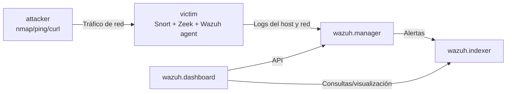

# Laboratorio SIEM con Wazuh (Docker)

Este proyecto despliega un laboratorio SIEM de 3 nodos lógicos con Docker:

- `siem-server`: `wazuh.manager` + `wazuh.indexer` + `wazuh.dashboard`
- `victim`: `Wazuh agent` + `Snort` + `Zeek`
- `attacker`: generación de tráfico y simulación de ataque

Todo corre dentro de la misma red Docker para validar el flujo completo:
**ataque -> detección -> recolección de logs -> análisis SIEM**.

## Arquitectura



## Requisitos

- Docker
- Docker Compose

> En Apple Silicon (M1/M2/M3), `victim` y `attacker` usan `linux/amd64` para compatibilidad con Zeek.  
> Zeek se instala desde su repositorio oficial OBS dentro de `victim`.

## Puertos expuestos

- Dashboard: `https://localhost:5602`
- Indexer: `https://localhost:9201`
- API Manager: `https://localhost:55000`
- Servicio HTTP de victim: `http://localhost:8081`

## Arranque del entorno

1. Generar certificados del indexer:

```bash
docker compose -f generate-indexer-certs.yml run --rm generator
```

2. Levantar servicios:

```bash
docker compose up -d --build
```

3. Verificar estado:

```bash
docker compose ps
```

> Si cambias `docker-compose.yml` (por ejemplo, nuevos volúmenes para reglas/decoders), aplica:
>
> ```bash
> docker compose up -d wazuh.manager
> ```
>
> `restart` no siempre aplica cambios de montajes.

## Simulación de ataque (básica)

Ejecuta tráfico de prueba desde `attacker` hacia `victim`:

```bash
docker compose exec attacker /usr/local/bin/attack-simulate.sh victim 8080
```

Incluye:
- ICMP (`ping`)
- Escaneo TCP (`nmap`)
- Ráfaga HTTP (`curl`)

## Simulación de cadena de ataque (completa)

Script integral que:
1) ejecuta la simulación de red, y  
2) inyecta eventos SSH reales para validar reglas threatfeed.

```bash
./scripts/run-attack-chain.sh
```

Opcionalmente:

```bash
./scripts/run-attack-chain.sh victim 8080 196.251.85.62
```

## Prueba específica de Zeek

Este script valida si Zeek está funcionando y escribiendo logs (`conn.log`, `http.log`, `notice.log`) y además fuerza eventos puente para visualización en Wazuh:

```bash
./scripts/test-zeek.sh
```

Con parámetros opcionales:

```bash
./scripts/test-zeek.sh victim 8080 6
```

## Validación técnica (comandos)

Ver logs del `victim`:

```bash
docker compose logs victim --tail=120
```

Ver logs del manager:

```bash
docker compose logs wazuh.manager --tail=200
```

Listar agentes registrados:

```bash
docker compose exec wazuh.manager /var/ossec/bin/agent_control -l
```

## Validación en Dashboard

- URL: `https://localhost:5602`
- Usuario: `admin`
- Contraseña: `SecretPassword`

En `Discover` (índice `wazuh-alerts-*`), usa estas consultas:

```text
agent.name:"victim-agent"
```

```text
decoder.name:snort
```

```text
rule.id:(100200 OR 100201)
```

```text
decoder.name:"zeek-wazuh"
```

```text
rule.id:(100300 OR 100301 OR 100302 OR 100303)
```

```text
location:"/var/log/zeek/zeek-wazuh.log"
```

## Reglas threatfeed personalizadas

Archivo: `config/wazuh_manager/rules/threatfeed_rules.xml`

- `100200` (nivel 14): IP maliciosa + `Accepted password` en SSH
- `100201` (nivel 10): IP maliciosa + `Failed password` en SSH

Esto permite demostrar alertas de severidad alta y media basadas en IOC local (`malicious-ip`).

## Parser/Reglas Zeek personalizadas para Dashboard

Archivos:

- `config/wazuh_manager/decoders/zeek_decoders.xml`
- `config/wazuh_manager/rules/zeek_dashboard_rules.xml`

IDs de reglas:

- `100300`: evento Zeek ingerido por el puente `zeek-wazuh`
- `100301`: evento HTTP detectado (`GET`)
- `100302`: conexión hacia puerto `8080`
- `100303`: HTTP con `curl` user-agent

Objetivo: asegurar visualización de eventos Zeek en Dashboard sin depender de parsers externos.

## Troubleshooting rápido

- API en `Offline` dentro de Dashboard:
  1) `docker compose ps`  
  2) `docker compose logs wazuh.manager --tail=200`  
  3) `docker compose up -d wazuh.manager`  
  4) En Dashboard: `Server APIs -> Check connection -> Refresh`
